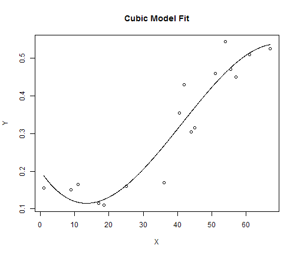

Polynomial Models for Allele dataset
========================================================
Stat 2050
-----------
Load the dataset into R and attach it
### 


```r
lap <- read.csv(file = "C:\\Users\\Aaron\\Documents\\Datasets\\Sokal&RohkfTable16x4LapFreq.csv", 
    header = T)
head(lap)
```

```
##       Y    X
## 1 0.155  1.0
## 2 0.150  9.0
## 3 0.165 11.0
## 4 0.115 17.0
## 5 0.110 18.5
## 6 0.160 25.0
```

```r
attach(lap)
```


Create a cubic model for the data  
The "I" stands for **Indicator Variable**
### 


```r
lm.3 <- lm(Y ~ X + I(X^2) + I(X^3))
```


Now we must create the line that will fit the points
#### 

```r
pts <- seq(min(X), max(X), length = 1000)
make.cubic <- sapply(pts, function(x) coef(lm.3) %*% x^(0:3))
```


```r
plot(X, Y, main = "Cubic Model Fit")  ## This plots the points
lines(pts, make.cubic)  ## This will fit the line we made previously
```



